  

**[StatFlix](https://statflix-lake.vercel.app)** was created to let Netflix users upload and analyze their viewing history.

## About
StatFlix is a ["Spotify Wrapped"](https://newsroom.spotify.com/2025-12-03/2025-wrapped-user-experience/) style web app that turns your Netflix `ViewingActivity.csv` into a visual recap of your watching habits. Upload your exported viewing history and StatFlix parses it into meaningful stats like your top genres, total watch time, most watched titles, biggest binge streaks, completed shows, and your oldest throwback picks. All titles are enriched with TMDb metadata such as posters and release dates, then presented as an animated, slide-based story you can click through and share.

  

## How It Works
You upload your history (or try the sample dataset), and the backend parses each row, normalizes titles, and matches them against [TMDb](https://www.themoviedb.org/) to pull metadata like media type, genres, release dates, and poster paths. As it processes titles, it aggregates everything into a single stats JSON: top genres, unique titles, total watch time, top titles by minutes watched, binge streaks, completed shows, and oldest watched show/movie.

The frontend then fetches that stats JSON and presents it as a scrollable, animated slideshow using Framer Motion. Posters are displayed using TMDb’s image base URL plus each title’s `poster_path`, and the UI guides you through each stat card like a mini Netflix Wrapped, with smooth transitions and keyboard/scroll navigation.

```mermaid
flowchart TD
    %% Docker Compose Orchestrator
    subgraph "Docker-Compose Orchestrator"
        direction TB
        DC["docker-compose.yml"]:::orchestrator
        %% Frontend Container
        subgraph "Frontend Container (3000)" 
            direction TB
            FEdocker["Dockerfile"]:::frontend
            FEApp["App.js"]:::frontend
            FEIndex["index.js"]:::frontend
            FEHome["HomePage.js"]:::frontend
            FECarousel["CarouselPage.js"]:::frontend
            FEComp["components/"]:::frontend
        end
        %% Backend Container
        subgraph "Backend Container (8000)"
            direction TB
            BEdocker["Dockerfile"]:::backend
            BEServer["server.js"]:::backend
            %% Layers
            subgraph "API Layer"
                direction TB
                BETMDB["tmdb.js"]:::backend
            end
            subgraph "Business Logic"
                direction TB
                BEHelper["helpers.js"]:::backend
                BEKaggle["kaggle.js"]:::backend
                BELog["logging.js"]:::backend
            end
            subgraph "Data Layer"
                direction TB
                BEdb["db.js"]:::backend
            end
            subgraph "CSV Data & Tests"
                direction TB
                CSV1["ViewingActivity.csv"]:::backend
                CSV2["big.csv"]:::backend
                KaggleData["kaggle/"]:::backend
                Tests["tests/"]:::backend
            end
        end
        %% Database Container
        subgraph "PostgreSQL (5432)"
            direction TB
            DB["PostgreSQL"]:::database
        end
    end

    %% External Entities
    User["User (Browser)"]:::external
    TMDb["TMDb API"]:::external

    %% Interactions
    User -->|"HTTP GET/POST"| FEApp
    FEApp -->|"HTTP POST /upload\nHTTP GET /analytics"| BEServer
    BEServer -->|"SQL INSERT/SELECT"| BEdb
    BEServer -->|"HTTP GET metadata"| BETMDB
    BETMDB -->|"HTTPS"| TMDb

    %% Click Events
    click DC "https://github.com/karanvirheer/statflix/blob/main/docker-compose.yml"
    click FEdocker "https://github.com/karanvirheer/statflix/tree/main/frontend/Dockerfile"
    click FEApp "https://github.com/karanvirheer/statflix/blob/main/frontend/src/App.js"
    click FEIndex "https://github.com/karanvirheer/statflix/blob/main/frontend/src/index.js"
    click FEHome "https://github.com/karanvirheer/statflix/blob/main/frontend/src/pages/HomePage.js"
    click FECarousel "https://github.com/karanvirheer/statflix/blob/main/frontend/src/pages/CarouselPage.js"
    click FEComp "https://github.com/karanvirheer/statflix/tree/main/frontend/src/components/"
    click BEdocker "https://github.com/karanvirheer/statflix/tree/main/backend/Dockerfile"
    click BEServer "https://github.com/karanvirheer/statflix/blob/main/backend/src/server.js"
    click BETMDB "https://github.com/karanvirheer/statflix/blob/main/backend/src/api/tmdb.js"
    click BEHelper "https://github.com/karanvirheer/statflix/blob/main/backend/src/utils/helpers.js"
    click BEKaggle "https://github.com/karanvirheer/statflix/blob/main/backend/src/utils/kaggle.js"
    click BELog "https://github.com/karanvirheer/statflix/blob/main/backend/src/utils/logging.js"
    click BEdb "https://github.com/karanvirheer/statflix/blob/main/backend/src/db/db.js"
    click CSV1 "https://github.com/karanvirheer/statflix/blob/main/backend/data/ViewingActivity.csv"
    click CSV2 "https://github.com/karanvirheer/statflix/blob/main/backend/data/big.csv"
    click KaggleData "https://github.com/karanvirheer/statflix/tree/main/backend/data/kaggle/"
    click Tests "https://github.com/karanvirheer/statflix/tree/main/backend/data/tests/"

    %% Styles
    classDef orchestrator fill:#D6BBFA,stroke:#79589F,color:#000;
    classDef frontend fill:#B3E5FC,stroke:#0288D1,color:#000;
    classDef backend fill:#C8E6C9,stroke:#388E3C,color:#000;
    classDef database fill:#FFE0B2,stroke:#F57C00,color:#000;
    classDef external fill:#E0E0E0,stroke:#9E9E9E,color:#000;
```

  

## Tech Stack

**Frontend**  
- [React.js](https://reactjs.org/) – UI library for building interactive interfaces  
- [TailwindCSS](https://tailwindcss.com/) – Utility-first CSS framework  

**Backend**  
- [Node.js](https://nodejs.org/) – JavaScript runtime for backend logic  
- [Express.js](https://expressjs.com/) – Web framework for building APIs  

**Database**  
- [PostgreSQL](https://www.postgresql.org/) – Relational database for storing user and title data  

**API & Data Enrichment**  
- [TMDb API](https://www.themoviedb.org/documentation/api) – Used to enrich Netflix titles with genres, runtime, etc.

**Deployment & Environment**  
- [Docker](https://www.docker.com/) – Containerized environment for consistent development and deployment  
- Vercel / Render - Hosting
